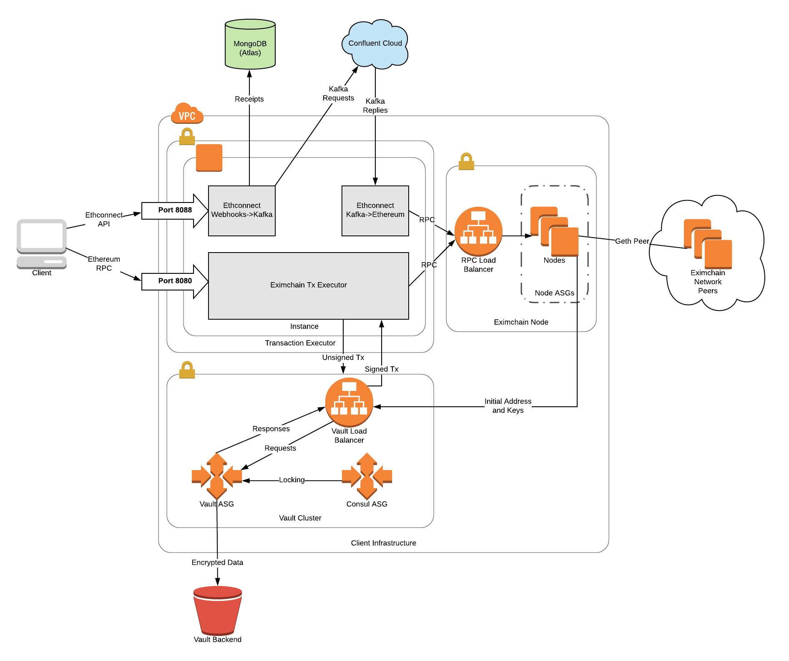

Table of Contents
=================

   * [Warning](#warning)
   * [Work In Progress](#work-in-progress)
   * [Quick Start Guide](#quick-start-guide)
      * [Prerequisites](#prerequisites)
   * [Generate SSH key for EC2 instances](#generate-ssh-key-for-ec2-instances)
      * [Build AMIs to launch the instances with](#build-amis-to-launch-the-instances-with)
      * [Launch Network with Terraform](#launch-network-with-terraform)
      * [Launch and configure vault](#launch-and-configure-vault)
         * [Unseal additional vault servers](#unseal-additional-vault-servers)
      * [Access Other Components](#access-other-components)
      * [Example Ethconnect Test](#example-ethconnect-test)
      * [Destroy the Network](#destroy-the-network)
   * [Architecture](#architecture)

Created by [gh-md-toc](https://github.com/ekalinin/github-markdown-toc)


# Warning
This software launches and uses real AWS resources. It is not a demo or test. By using this software, you will incur the costs of any resources it uses in your AWS account.

# Work In Progress
This repository is a work in progress. A more complete version of this README and code is coming soon.

# Quick Start Guide

## Prerequisites

* You must have AWS credentials at the default location (typically `~/.aws/credentials`)
* You must have the following programs installed on the machine you will be using to launch the network:
    * Python 2.7
    * Hashicorp Packer
    * Hashicorp Terraform

# Generate SSH key for EC2 instances

Generate an RSA key with ssh-keygen. This only needs to be done once. If you change the output file location you must change the key paths in the terraform variables file later.

```sh
$ ssh-keygen -t rsa -f ~/.ssh/quorum
# Enter a password if you wish
```

Add the key to your ssh agent. This must be done again if you restart your computer. If this is not done, it will cause problems provisioning the instances with terraform.

```sh
$ ssh-add ~/.ssh/quorum
# Enter your password if there is one
```

## Build AMIs to launch the instances with

You may skip this step. If you do, your AMI will be the most recent one built by the official Eximchain AWS Account. We try to keep this as recent as possible but currently no guarantees are made. We highly recommend building your own AMI for any production use.

Use packer to build the AMIs needed to launch instances

```sh
$ cd packer
$ packer build vault-consul.json
# Wait for build
$ packer build transaction-executor.json
# Wait for build
$ cd ..
```

You may wish to build an AMI for the eximchain node as well. Instructions can be found in [this repository](https://github.com/Eximchain/terraform-aws-eximchain-node). Note that if you wish to connect to the test network, you will need to build your own AMI.

## Launch Network with Terraform

Copy the example.tfvars file

```sh
$ cd terraform
$ cp example.tfvars terraform.tfvars
```

Fill in your username as the `cert_owner`:

```sh
$ sed -i '' "s/FIXME_USER/$USER/" terraform.tfvars
```

If you did the build yourself, make sure to specify a `tx_executor_ami` variable and a `vault_consul_ami` variable with the resulting AMI IDs.

Check terraform.tfvars and change any values you would like to change. Note that the values given in examples.tfvars is NOT completely AWS free tier eligible, as they include t2.small and t2.medium instances. We do not recommend using t2.micro instances, as they were unable to compile solidity during testing.

If it is your first time using this package, you will need to run `terraform init` before applying the configuration.

Apply the terraform configuration

```sh
$ terraform apply
# Enter "yes" and wait for infrastructure creation
```

Note the IPs in the output or retain the terminal output. You will need them to finish setting up the cluster.

## Launch and configure vault

Pick a vault server IP to ssh into:

```sh
$ IP=<vault server IP>
$ ssh ubuntu@$IP
```

Initialize the vault. Choose the number of key shards and the unseal threshold based on your use case. For a simple test cluster, choose 1 for both. If you are using enterprise vault, you may configure the vault with another unseal mechanism as well.

```sh
$ KEY_SHARES=<Number of key shards>
$ KEY_THRESHOLD=<Number of keys needed to unseal the vault>
$ vault init -key-shares=$KEY_SHARES -key-threshold=$KEY_THRESHOLD
```

Unseal the vault and initialize it with permissions for the quorum nodes. Once setup-vault.sh is complete, the quorum nodes will be able to finish their boot-up procedure. Note that this example is for a single key initialization, and if the key is sharded with a threshold greater than one, multiple users will need to run the unseal command with their shards.

```sh
$ UNSEAL_KEY=<Unseal key output by vault init command>
$ vault unseal $UNSEAL_KEY
$ ROOT_TOKEN=<Root token output by vault init command>
$ /opt/vault/bin/setup-vault.sh $ROOT_TOKEN
```

If any of these commands fail, wait a short time and try again. If waiting doesn't fix the issue, you may need to destroy and recreate the infrastructure.

### Unseal additional vault servers

You can proceed with initial setup with only one unsealed server, but if all unsealed servers crash, the vault will become inaccessable even though the severs will be replaced. If you have multiple vault servers, you may unseal all of them now and if the server serving requests crashes, the other servers will be on standby to take over.

SSH each vault server and for enough unseal keys to reach the threshold run:
```sh
$ UNSEAL_KEY=<Unseal key output by vault init command>
$ vault unseal $UNSEAL_KEY
```

## Access Other Components

TODO

## Example Ethconnect Test

```sh
NODE=$(cat /opt/transaction-executor/info/quorum-url.txt)
PORT="8088" # Change this if you changed the port in terraform
vim payload.yml # Make this a YAML payload for ethconnect

curl -X POST --data-binary @payload.yml -H "Content-type: application/x-yaml" http://$NODE:$PORT/hook
```

## Destroy the Network

If this is a test and you are finished with your infrastructure, you will likely want to destroy your network to avoid incurring extra AWS costs:

```sh
# From the terraform directory
$ terraform destroy
# Enter "yes" and wait for the network to be destroyed
```

If it finishes with a single error that looks like as follows, ignore it.  Rerunning `terraform destroy` will show that there are no changes to make.

```
Error: Error applying plan:

1 error(s) occurred:

* aws_s3_bucket.quorum_vault (destroy): 1 error(s) occurred:

* aws_s3_bucket.quorum_vault: Error deleting S3 Bucket: NoSuchBucket: The specified bucket does not exist
	status code: 404, request id: 8641A613A9B146ED, host id: TjS8J2QzS7xFgXdgtjzf6FR1Z2x9uqA5UZLHaMEWKg7I9JDRVtilo6u/XSN9+Qnkx+u5M83p4/w= "quorum-vault"

Terraform does not automatically rollback in the face of errors.
Instead, your Terraform state file has been partially updated with
any resources that successfully completed. Please address the error
above and apply again to incrementally change your infrastructure.
```

# Architecture



This diagram shows the architecture of this infrastructure. It consists of three modules: a vault cluster, a cluster of eximchain nodes, and a single transaction executor instance.

* The **eximchain nodes** join the network as geth peers and execute RPC transactions on the chain.

* The **vault cluster** stores the keys for each node's primary account. It will also be used as a general purpose key management system, eventually allowing user keys to be stored on the vault and sign transactions from the vault.

* The **transaction executor** exposes two ports: An RPC proxy on port `8080`, and an [ethconnect](https://github.com/kaleido-io/ethconnect) webhook bridge on port `8088`. Either of these can be used to interact with the chain, though the ethconnect API is distinct from the ethereum RPC protocol. The RPC proxy behaves exactly as a geth RPC port and currently just proxies requests to the nodes. This behavior may be further optimized in the future.  
